# Amazon Sales Data Science

## 1. Introdução

Este projeto analisa um catálogo de produtos da Amazon para identificar padrões de preço, desconto, satisfação e popularidade aparente. O objetivo é apoiar decisões de curadoria, posicionamento e priorização de produtos por meio de análise exploratória, modelos preditivos, classificação, segmentação e processamento de linguagem natural (NLP).

A base não contém vendas reais, receita, quantidade vendida nem histórico temporal. Por isso:

- `rating_count` é usado como proxy de popularidade (engajamento ou demanda aparente);
- `rating` é usado como proxy de satisfação média dos consumidores;
- os resultados descrevem padrões do catálogo analisado e não devem ser interpretados como causalidade ou desempenho comercial efetivo.

## 2. Metodologia

### Base de dados e variáveis

O projeto utiliza o [Amazon Sales Dataset](https://www.kaggle.com/datasets/karkavelrajaj/amazon-sales-dataset), obtido pela API do Kaggle. Após limpeza e engenharia de atributos, a base contém 1.465 produtos e 29 colunas. Os preços do arquivo original estão em rupias indianas.

As principais variáveis derivadas são:

- `discount_value`: diferença entre preço original e preço com desconto;
- `log_rating_count = log1p(rating_count)`: transformação usada para reduzir a forte assimetria da quantidade de avaliações;
- `popular_product`: produto com `rating_count` maior ou igual ao percentil 75, correspondente a 17.325 avaliações;
- `high_rating`: produto com `rating >= 4,0`;
- níveis de categoria, faixas de preço e desconto e comprimentos dos campos textuais.

### Tarefas e algoritmos

| Tarefa | Técnicas | Explicação breve |
|---|---|---|
| Predição | Regressão Linear, Random Forest, XGBoost e LightGBM | A regressão linear funciona como baseline; Random Forest combina árvores independentes; XGBoost e LightGBM constroem árvores sequencialmente para capturar relações não lineares. |
| Classificação | Regressão Logística, Random Forest, XGBoost e LightGBM | Estimam se um produto pertence ao quartil superior de `rating_count`; a regressão logística é o baseline linear e os modelos de árvores capturam interações mais complexas. |
| Clusterização | K-Means, Hierarchical Clustering e DBSCAN | K-Means agrupa por proximidade a centroides; o método hierárquico agrega produtos por similaridade; o DBSCAN identifica regiões densas e pontos de ruído. |
| Visualização de clusters | PCA 2D | Reduz as variáveis padronizadas a duas dimensões para inspeção visual, sem substituir a segmentação original. |
| NLP | Frequência, termos distintivos, TF-IDF, nuvem de palavras e contagem de palavras | Resume temas recorrentes e diferenças relativas entre grupos de popularidade e rating. |

Os modelos supervisionados usam uma divisão treino/teste de 80%/20%, com `random_state=42`. A classificação preserva a proporção das classes. Esta versão é baseline e não realiza validação cruzada nem otimização extensiva de hiperparâmetros.

### Pipeline

| Script | Responsabilidade | Entrada | Principais saídas |
|---|---|---|---|
| [`1_tratamento.py`](src/1_tratamento.py) | Limpa tipos, separa categorias e cria variáveis derivadas. | CSV em `data/raw/` | `data/processed/amazon_sales_processed.csv` |
| [`2_analise_exploratoria.py`](src/2_analise_exploratoria.py) | Gera resumos, rankings, distribuições e relações entre variáveis. | Base tratada | Tabelas e figuras de EDA |
| [`3_predicao.py`](src/3_predicao.py) | Prevê `log_rating_count`. | Base tratada | Métricas e gráfico observado vs. previsto |
| [`4_classificacao.py`](src/4_classificacao.py) | Classifica produtos como populares ou não populares. | Base tratada | Métricas, importâncias e matriz de confusão |
| [`5_clusterizacao.py`](src/5_clusterizacao.py) | Segmenta produtos e cria projeções PCA. | Base tratada | Base com clusters, tabelas-resumo e figuras PCA |
| [`6_analise_nlp.py`](src/6_analise_nlp.py) | Analisa descrições, títulos e conteúdos de reviews. | Base tratada | Frequências, TF-IDF, termos distintivos e figuras |

Para instalar as dependências e executar o projeto a partir da raiz:

Execute o pipeline na ordem abaixo:

```powershell
pip install -r requirements.txt
python src/1_tratamento.py
python src/2_analise_exploratoria.py
python src/3_predicao.py
python src/4_classificacao.py
python src/5_clusterizacao.py
python src/6_analise_nlp.py
```

## 3. Resultados

### 3.1 Análise exploratória dos dados

| Indicador | Resultado |
|---|---:|
| Produtos analisados | 1.465 |
| Categorias principais | 9 |
| Rating médio | 4,10 |
| Mediana de `rating_count` | 5.178 |
| Média de `rating_count` | 18.270,56 |
| Produtos populares | 367 (25,1%) |

As três categorias mais representadas são `Electronics` (526 produtos), `Computers&Accessories` (453) e `Home&Kitchen` (448), que juntas concentram 97,4% da base. `Electronics` apresenta mediana de 10.689 avaliações e 39,0% de produtos populares; `Computers&Accessories`, mediana de 7.732 e 27,4%; e `Home&Kitchen`, mediana de 2.305,5 e 8,0%.

Categorias como `MusicalInstruments` e `Toys&Games` exibem medianas elevadas de `rating_count`, mas possuem somente dois e um produto, respectivamente. Esses resultados não são representativos e não sustentam recomendações isoladas.

Os preços original e com desconto e a quantidade de avaliações têm forte assimetria à direita, com poucos produtos muito acima do restante do catálogo. Os ratings concentram-se entre 4,0 e 4,5. As relações lineares com popularidade aparente são fracas: `discount_percentage` × `rating_count` = 0,011, `discount_percentage` × `log_rating_count` = -0,112 e `rating` × `log_rating_count` = 0,233. Portanto, descontos maiores não explicam, isoladamente, maior engajamento, enquanto satisfação apresenta associação positiva apenas moderada.

<p align="center">
  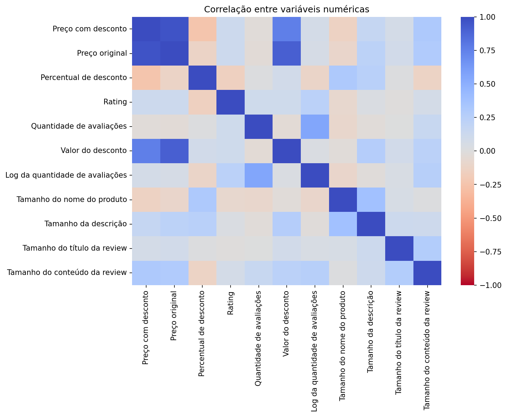
</p>

<details>
  <summary><strong>Ver distribuições e relações complementares</strong></summary>
  <br>
  <table>
    <tr>
      <td>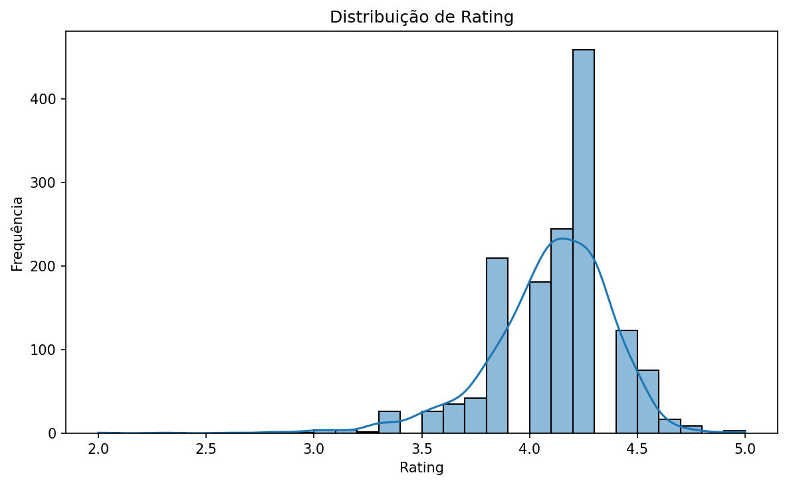
      <td>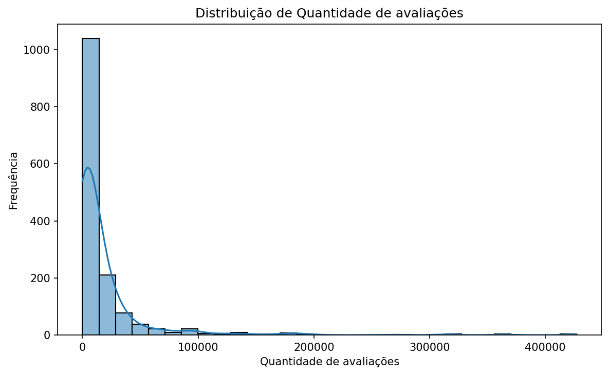
    </tr>
    <tr>
      <td>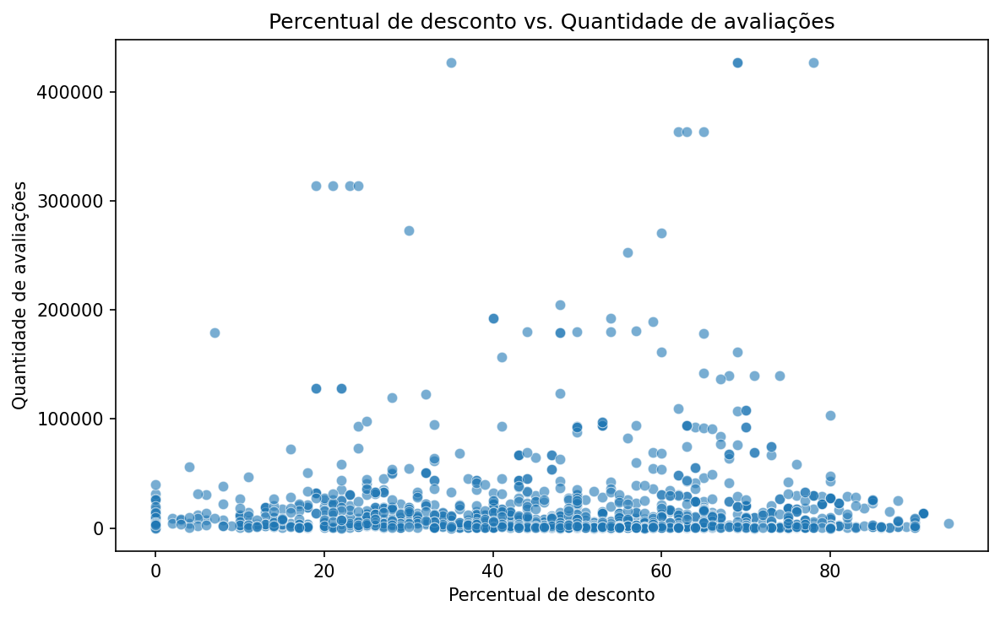
      <td>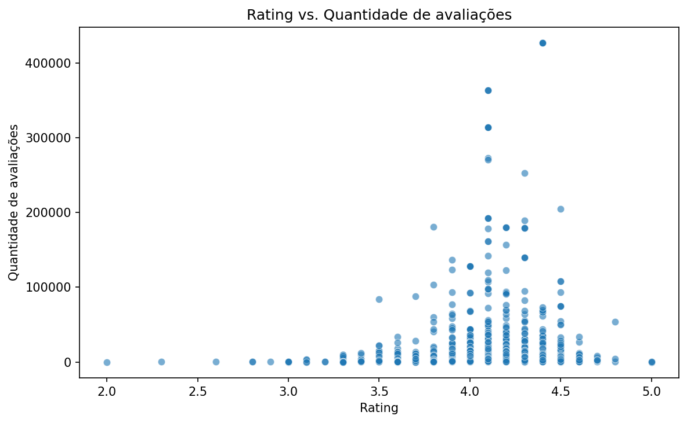
    </tr>
  </table>
</details>

### 3.2 Predição/regressão

A variável-alvo é `log_rating_count`. O Random Forest Regressor apresentou o melhor resultado, indicando que relações não lineares entre preço, desconto, categoria, rating e atributos textuais simples explicam parte da variação da popularidade aparente.

| Modelo | R² | MAE | RMSE | MAPE |
|---|---:|---:|---:|---:|
| Random Forest Regressor | 0,516 | 1,074 | 1,450 | 0,165 |
| XGBoost Regressor | 0,460 | 1,200 | 1,532 | 0,179 |
| LightGBM Regressor | 0,459 | 1,123 | 1,534 | 0,168 |
| Regressão Linear | 0,348 | 1,298 | 1,683 | 0,189 |

As métricas são calculadas na escala logarítmica do alvo; o MAPE de 0,165 não deve ser lido diretamente como erro percentual sobre a quantidade original de avaliações. O `R²` de 0,516 representa capacidade explicativa parcial e não justifica decisões automáticas.

<p align="center">
  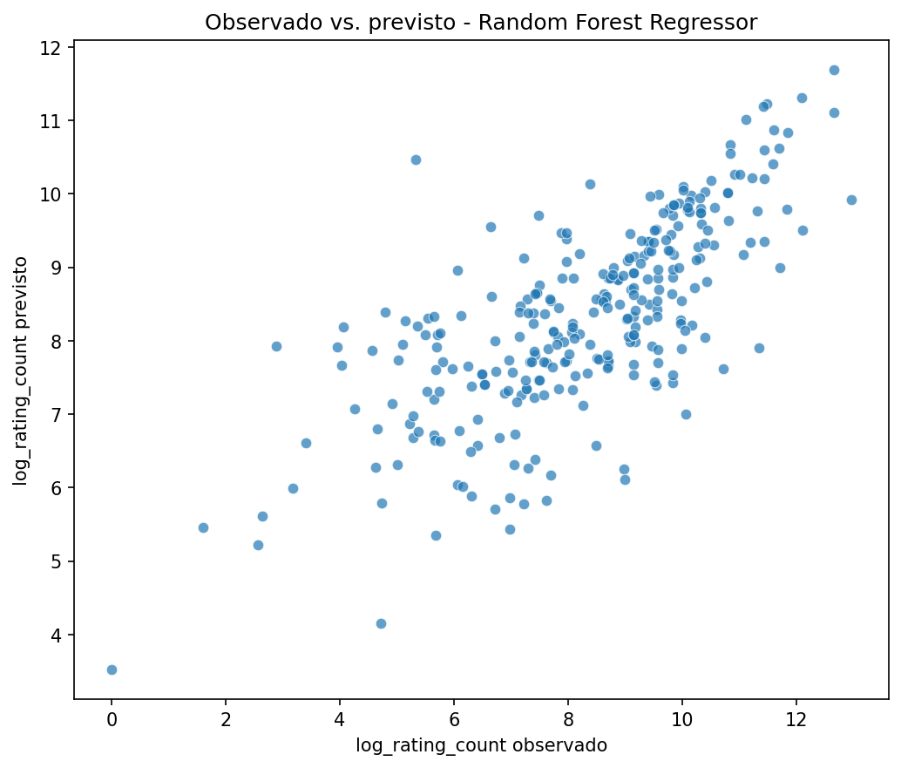
</p>

### 3.3 Classificação

O objetivo é identificar os produtos no quartil superior de `rating_count`. O Random Forest Classifier obteve o melhor F1-score; o LightGBM apresentou recall ligeiramente maior e pode ser preferível quando capturar mais candidatos populares for mais importante que reduzir falsos positivos.

| Modelo | Accuracy | Precision | Recall | F1-score |
|---|---:|---:|---:|---:|
| Random Forest Classifier | 0,877 | 0,878 | 0,589 | 0,705 |
| LightGBM Classifier | 0,863 | 0,800 | 0,603 | 0,688 |
| XGBoost Classifier | 0,853 | 0,788 | 0,562 | 0,656 |
| Regressão Logística | 0,785 | 0,609 | 0,384 | 0,471 |

Na amostra de teste, o Random Forest produziu 214 verdadeiros negativos, 43 verdadeiros positivos, 6 falsos positivos e 30 falsos negativos. O recall de 0,589 mostra que uma parcela relevante dos produtos populares ainda não é identificada.

<p align="center">
  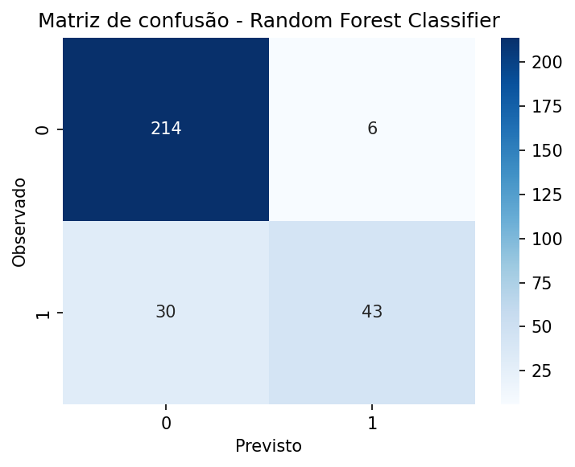
</p>

As maiores importâncias do modelo foram `review_content_length` (0,106), `discounted_price` (0,091), `product_name_length` (0,087), `about_product_length` (0,084), `discount_value` (0,082), `actual_price` (0,080), `review_title_length` (0,079), `discount_percentage` (0,073) e `rating` (0,069). Essas importâncias auxiliam a interpretação, mas não representam efeitos causais.

### 3.4 Clusterização

As variáveis de preço, desconto, rating e popularidade foram imputadas, padronizadas e segmentadas. O K-Means gerou os perfis mais diretos para uso exploratório:

| Cluster | Produtos | Preço com desconto mediano | Desconto mediano | Rating mediano | `rating_count` mediano | Perfil sugerido |
|---:|---:|---:|---:|---:|---:|---|
| 0 | 534 | ₹ 399,00 | 60% | 4,0 | 935 | `nichado_acessivel` |
| 1 | 33 | ₹ 32.999,00 | 38% | 4,3 | 3.837 | `nichado_caro` |
| 2 | 719 | ₹ 849,00 | 41% | 4,2 | 10.725 | `misto` |
| 3 | 132 | ₹ 13.244,50 | 33% | 4,2 | 11.591 | `popular_caro` |
| 4 | 47 | ₹ 709,00 | 54% | 4,1 | 178.912 | `popular_acessivel` |

O cluster 4 concentra popularidade aparente muito elevada, enquanto o cluster 0 combina desconto alto e baixo `rating_count`. Os nomes são rótulos heurísticos, não classes naturais ou recomendações automáticas. O método hierárquico também gerou cinco grupos; o DBSCAN foi menos granular, concentrando 1.411 produtos em um grupo e classificando 54 como ruído.

<p align="center">
  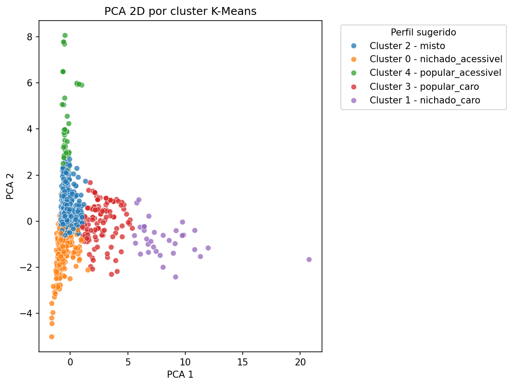
</p>

<details>
  <summary><strong>Ver comparações com clusterização hierárquica e DBSCAN</strong></summary>
  <br>
  <table>
    <tr>
      <td>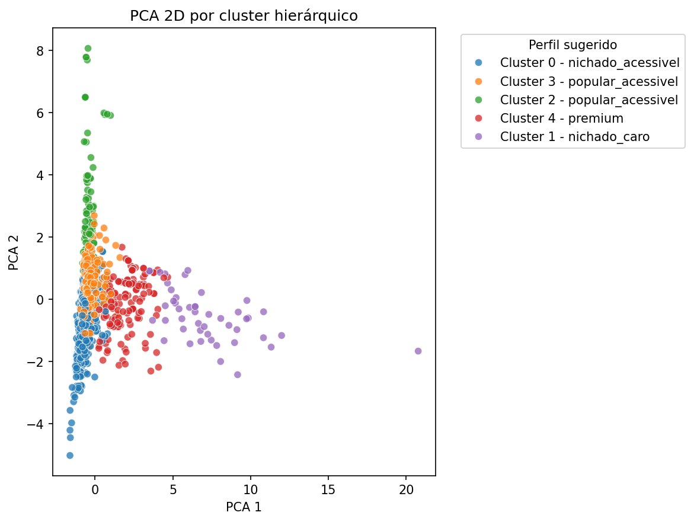
      <td>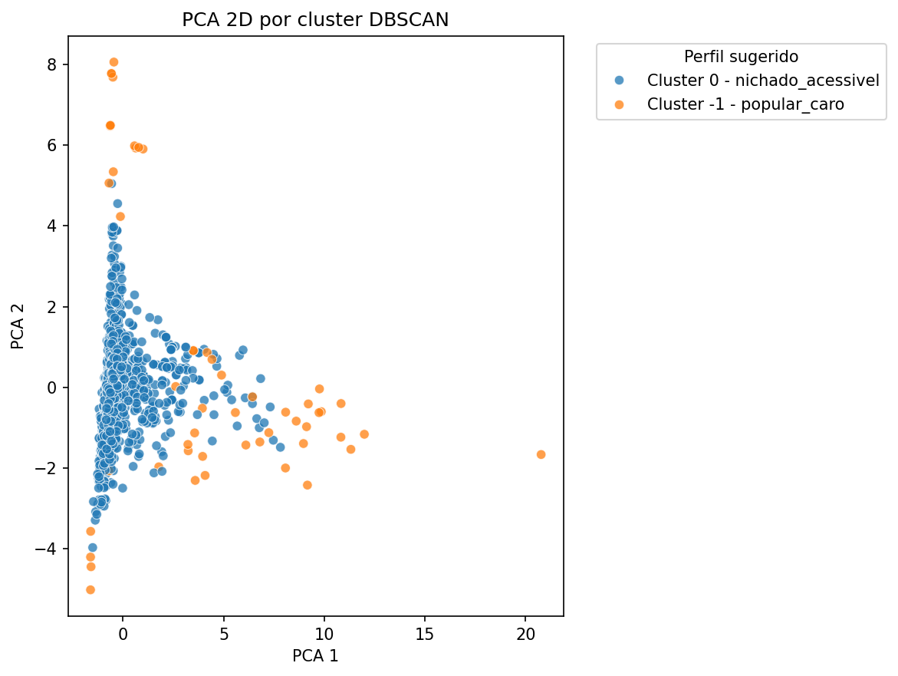
    </tr>
  </table>
</details>

### 3.5 NLP

Os campos `review_title`, `review_content` e `about_product` foram combinados e submetidos a limpeza básica. Os termos gerais mais frequentes foram `good` (10.451), `product` (6.818), `not` (4.658), `you` (4.343) e `but` (4.314).

Por frequência relativa e TF-IDF, `phone`, `watch`, `battery` e `camera` aparecem mais associados aos produtos populares. Nos produtos com rating baixo, `not`, `remote`, `noise`, `call` e `bass` indicam negação ou possíveis fricções em eletrônicos, áudio e comunicação. Essas associações também refletem a composição das categorias e não comprovam sentimento ou causa.

Produtos populares apresentam textos combinados mais longos: mediana de 340 palavras, contra 300 entre não populares. Produtos com rating alto têm mediana de 320 palavras, ante 281 no grupo de rating baixo. A sobreposição entre as distribuições, porém, é ampla.

<p align="center">
  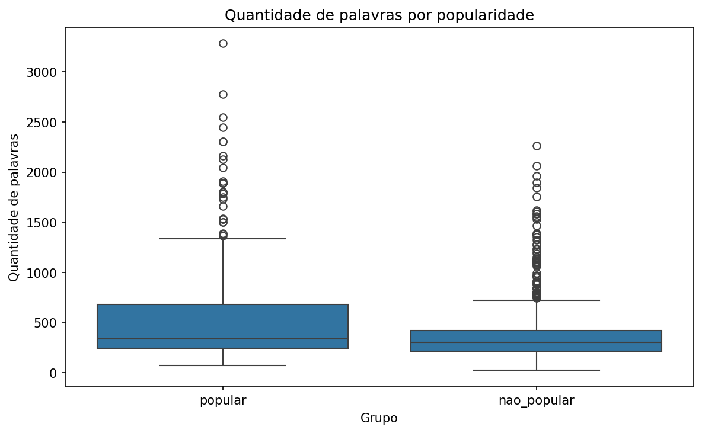
</p>

<details>
  <summary><strong>Ver resultados textuais complementares</strong></summary>
  <br>
  <table>
    <tr>
      <td>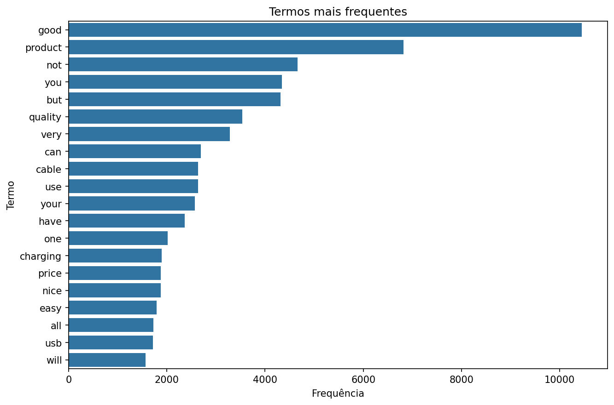
      <td>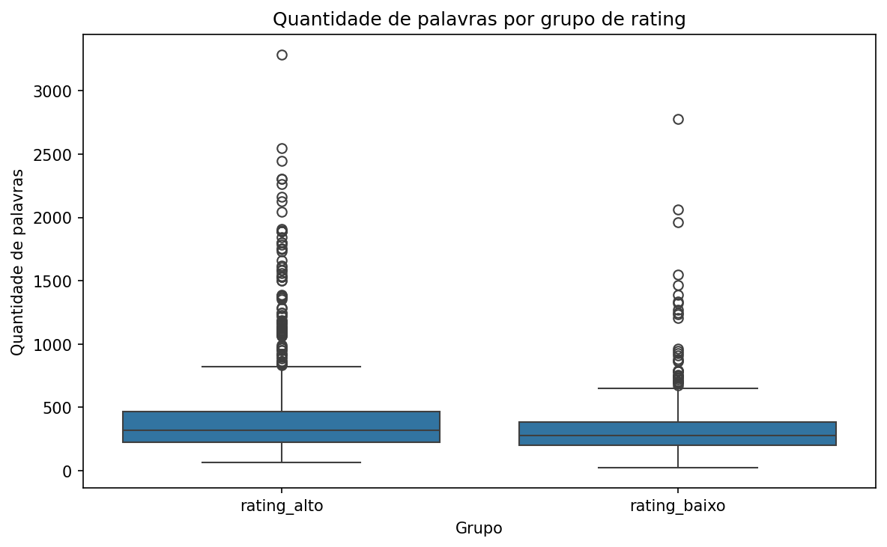
    </tr>
  </table>
</details>

Resultados complementares estão nas tabelas de [TF-IDF por popularidade](outputs/tables/nlp_tfidf_by_popularity.csv), [TF-IDF por rating](outputs/tables/nlp_tfidf_by_rating_group.csv), [termos distintivos por popularidade](outputs/tables/nlp_distinctive_terms_popular_vs_not_popular.csv) e [termos distintivos por rating](outputs/tables/nlp_distinctive_terms_high_vs_low_rating.csv).

## 4. Perguntas de negócio

1. **Quais categorias concentram produtos mais populares?** `Electronics` e `Computers&Accessories` combinam grande participação na base com medianas relevantes de `rating_count`; `Electronics` também possui 39,0% de produtos populares.

2. **Produtos com maior desconto tendem a ter maior `rating_count`?** Não de forma clara. A correlação com `rating_count` é praticamente nula (0,011) e com `log_rating_count` é levemente negativa (-0,112).

3. **Produtos mais caros recebem avaliações melhores ou piores?** A relação é fraca e positiva: preço original × rating = 0,122. A base não indica que preços maiores estejam associados a avaliações piores.

4. **Quais produtos combinam alto rating e alto número de avaliações?** Entre os destaques estão o cartão SanDisk Extreme SD 64 GB (rating 4,5; 205.052 avaliações), cabos AmazonBasics USB 2.0 (rating 4,5; até 107.687) e o SSD Crucial BX500 240 GB (rating 4,5; 92.925).

5. **Quais produtos têm alto rating, mas baixo `rating_count`?** Há 11 produtos com rating entre 4,7 e 5,0 fora do grupo popular. Exemplos são o Amazon Basics Wireless Mouse (5,0; 23 avaliações), o Oratech Coffee Frother (4,8; 28) e o Zuvexa Electric Foam Maker (4,7; 54), candidatos a ações de exposição e conteúdo.

6. **Quais produtos têm alto `rating_count`, mas rating baixo?** Existem **51 produtos populares com rating inferior a 4,0**, sobretudo eletrônicos e acessórios. Exemplos incluem boAt Airdopes 121v2 (3,8; 180.998 avaliações), JBL Tune 215BT (3,7; 87.798) e PTron Tangent Lite (3,5; 83.996).

7. **É possível prever a popularidade aparente?** Parcialmente. O Random Forest Regressor atingiu `R² = 0,516` para `log_rating_count`, superando os demais baselines sem explicar toda a variabilidade.

8. **É possível classificar produtos como populares?** Sim, como apoio à triagem. O Random Forest Classifier atingiu accuracy de 0,877 e F1-score de 0,705, mas seu recall de 0,589 ainda deixa produtos populares sem identificação.

9. **Quais segmentos aparecem na clusterização?** O K-Means separou produtos nichados acessíveis e caros, um grupo misto e dois perfis populares, diferenciados principalmente por preço e `rating_count`. O cluster 4 representa os itens populares acessíveis mais consolidados.

10. **O texto ajuda a explicar satisfação ou popularidade?** Sim, como sinal exploratório. Termos ligados a dispositivos e uso prático aparecem mais em produtos populares, enquanto negação e termos de fricção aparecem mais no grupo de rating baixo.

## 5. Considerações

### 5.1 Insights acionáveis

- **Priorizar análise comercial e curadoria em `Electronics` e `Computers&Accessories`.** Essas categorias combinam alto volume de produtos e maior popularidade aparente, sendo boas candidatas para ações de ranking, vitrine, campanhas e monitoramento competitivo.
- **Não usar desconto percentual como única alavanca de popularidade.** A relação entre desconto e `rating_count` foi fraca; descontos altos sem boa proposta de valor podem não gerar mais engajamento.
- **Criar lista de revisão para produtos populares com rating baixo.** Os 51 produtos populares com rating abaixo de 4,0 merecem investigação de qualidade, descrição, expectativa de uso, suporte ou problemas recorrentes em reviews.
- **Ativar produtos com alto rating e baixo `rating_count`.** Produtos bem avaliados, mas pouco populares, podem ser candidatos a melhoria de exposição, conteúdo, imagens, SEO interno ou campanhas pontuais.
- **Monitorar termos de fricção em reviews.** Termos como `not`, `noise`, `call`, `remote` e `bass` devem orientar análise qualitativa em produtos com rating baixo, especialmente em eletrônicos e áudio.
- **Usar modelos como triagem, não como decisão automática.** Random Forest teve melhor desempenho geral, mas o recall da classificação ainda mostra que parte dos produtos populares pode não ser capturada. O modelo deve apoiar priorização, não substituir análise humana.
- **Usar clusters para estratégias diferenciadas.** Produtos do cluster 4 podem ser tratados como populares consolidados; produtos do cluster 0 podem demandar revisão de posicionamento; produtos de preço mais alto devem ser analisados com critérios próprios de valor percebido.

### 5.2 Principais resultados

- Random Forest foi o melhor modelo tanto na regressão quanto na classificação, mas oferece capacidade preditiva apenas parcial.
- `Electronics` e `Computers&Accessories` concentram os resultados mais relevantes por terem volume e popularidade aparente elevados.
- Desconto percentual, isoladamente, não é uma boa explicação para popularidade, e rating apresenta associação positiva, porém moderada.
- Clusters e textos acrescentam contexto para diferenciar perfis e problemas, desde que interpretados de forma exploratória.

### 5.3 Próximos passos

- Aplicar validação cruzada, ajuste de hiperparâmetros e avaliação de estabilidade dos modelos e clusters.
- Deduplicar variantes de produtos ou separar treino e teste por grupos, reduzindo o risco de produtos muito semelhantes aparecerem nos dois conjuntos.
- Tratar explicitamente o desbalanceamento da classificação e avaliar limiares conforme o custo de falsos positivos e falsos negativos.
- Evoluir o NLP com normalização linguística, n-gramas, análise de sentimento e separação entre descrição comercial e reviews.
- Incorporar dados temporais, tráfego, vendas, receita e estoque para avaliar demanda real e mudanças de comportamento.

### 5.4 Limitações

As principais limitações são o recorte único e não temporal, o uso de avaliações como proxy, a concentração em poucas categorias, a presença de variantes semelhantes, o desbalanceamento das classes e a natureza heurística dos clusters. Correlações, importâncias de variáveis e termos textuais não estabelecem causalidade.
